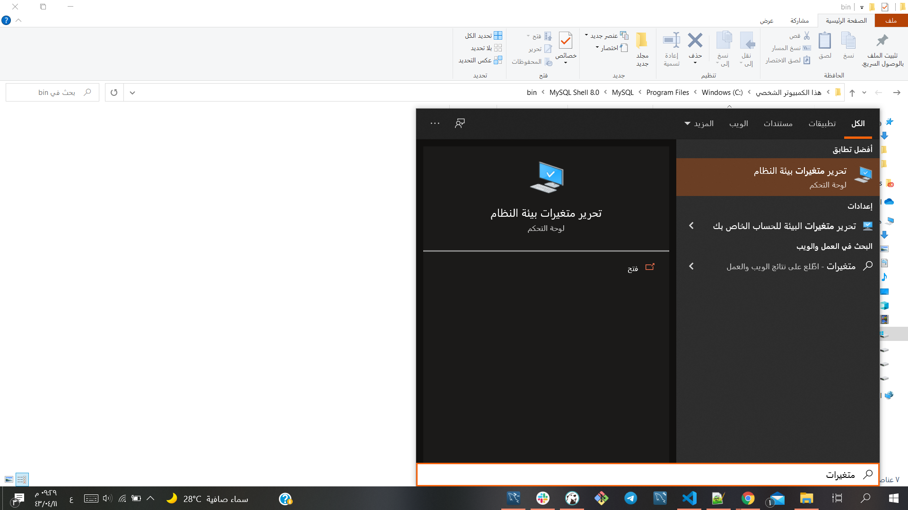
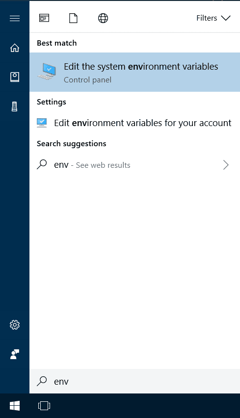
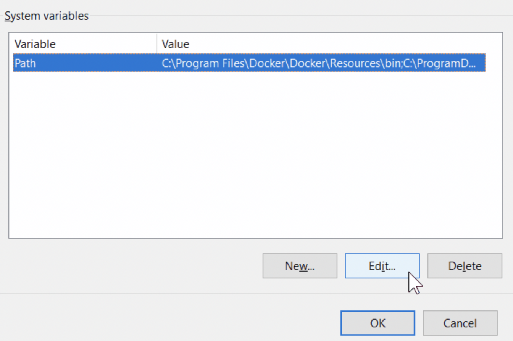
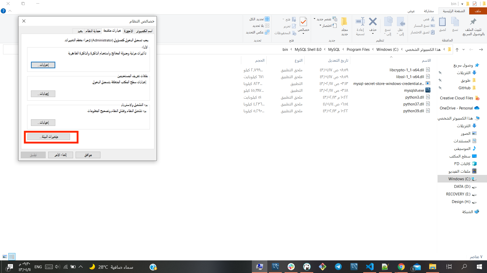
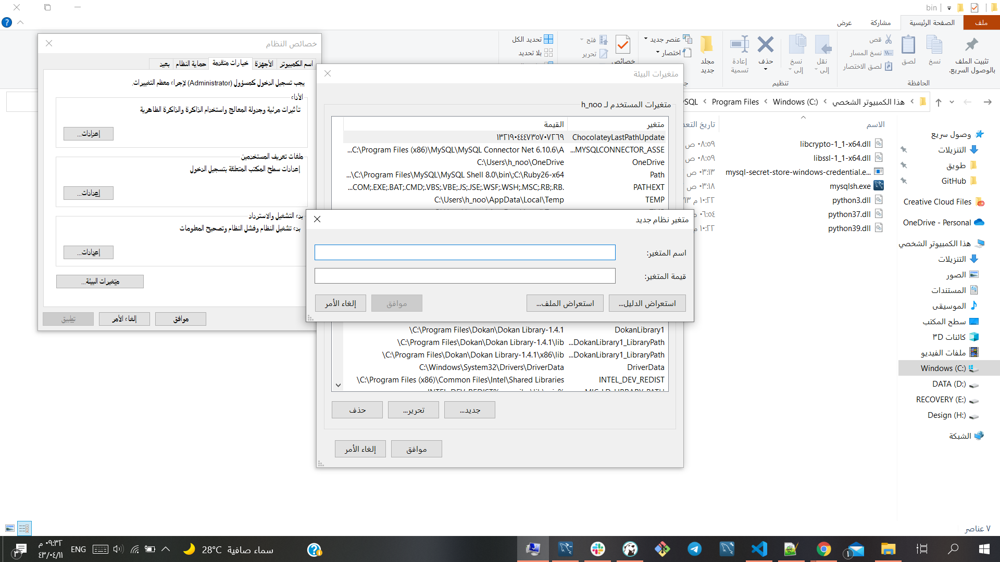
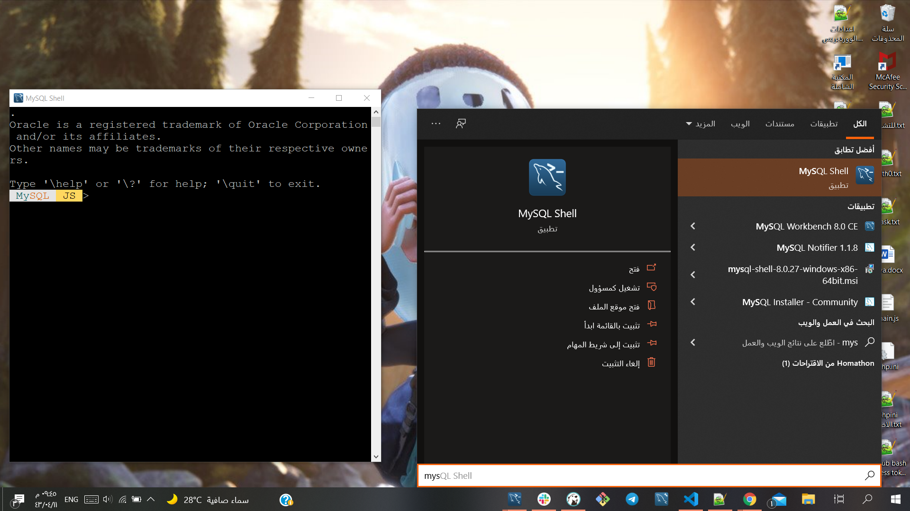

# Installation Guide 

## For Mac

1. Download MySQL Installer from https://dev.mysql.com/downloads/mysql/ and execute it.

2. Make sure you remember the password you enter here

3. Go to the terminal and to go to the path where your installer is in it should be `usr/local/mysql/bin`

4. Enter `./mysql -u root -p` to go to the mysql  

5. it will ask for the password enter the password you entered earlier.  

6. Create database called test then exit mysql  

7. go to dbeaver and connect to MySQL 

8. Enter the name of the database you created and the password 

## For Windows 

1. Download MySQL Installer from https://dev.mysql.com/downloads/mysql/ and execute it.

2. Make sure you remember the password you enter here

3. search for vriable enviroments in windows and open this 

4. write path in the variable and the path for the installer in the value the path should be something like this `C:\Program Files\MySQL\MySQL Shell 8.0\bin`

English: 

Arabic: 

5. search for mysqlshell and open it 

6. Enter the following command to enter mysql 

- `sql\`
- `connect root@localhost\`

7. when you are in mysql create database by using this command 

- `create database test;`

8. go to dbeaver and connect to MySQL 

9. Enter the name of the database you created and the password 

