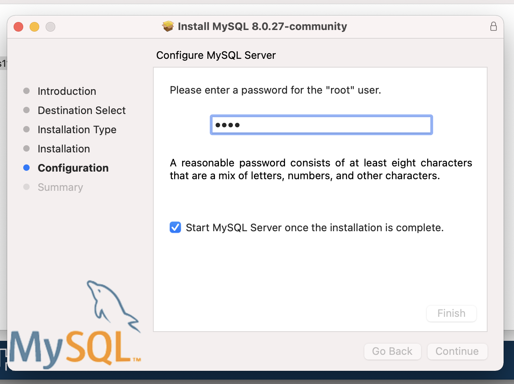
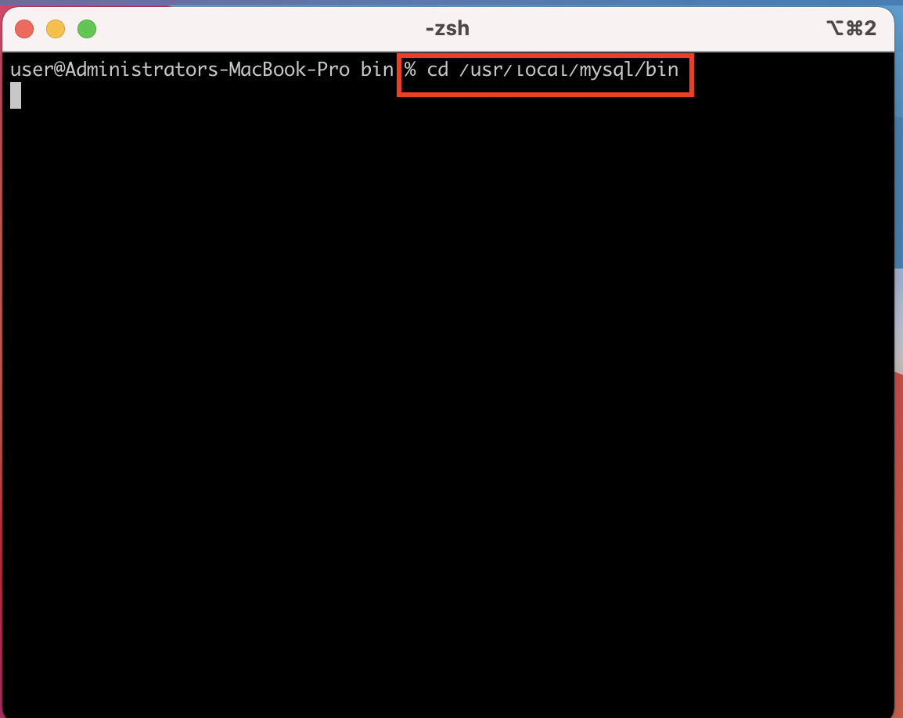
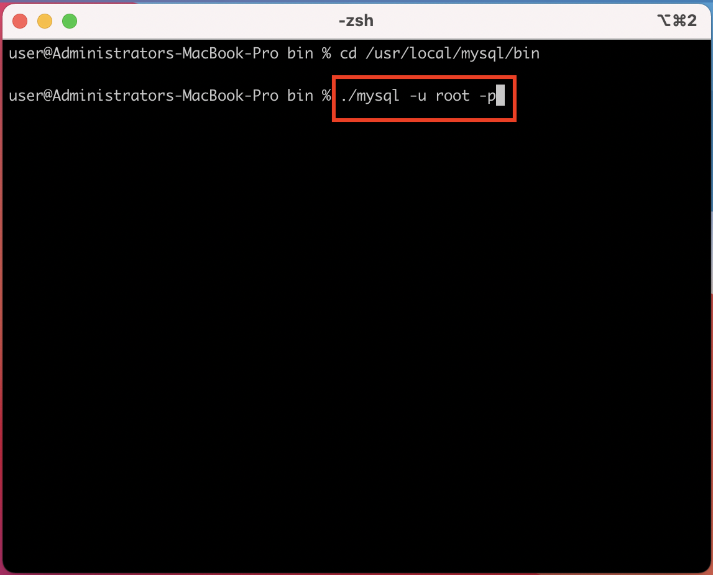
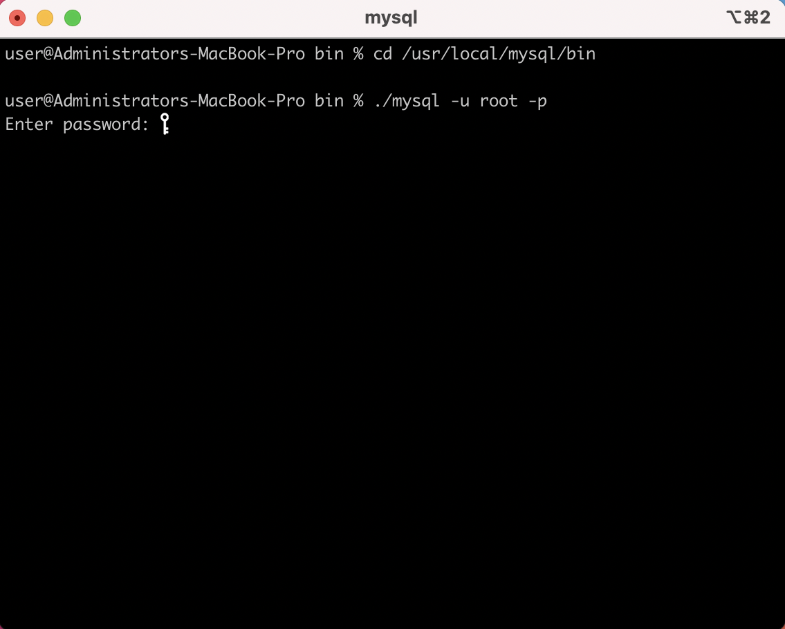
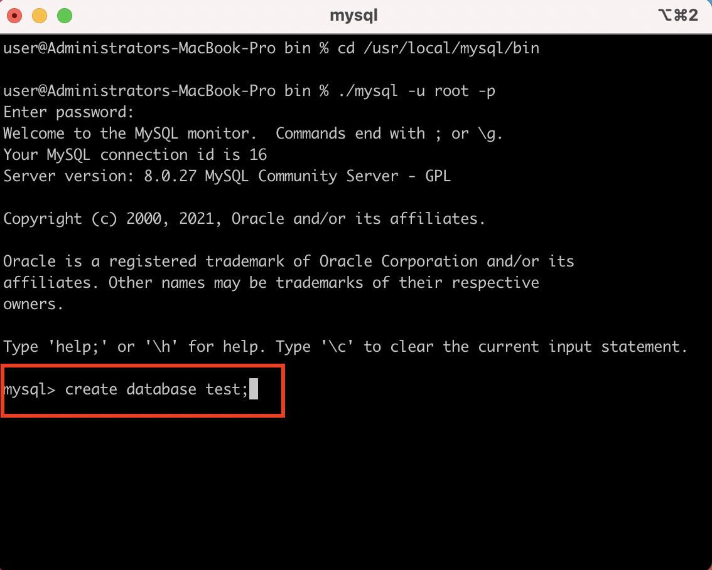
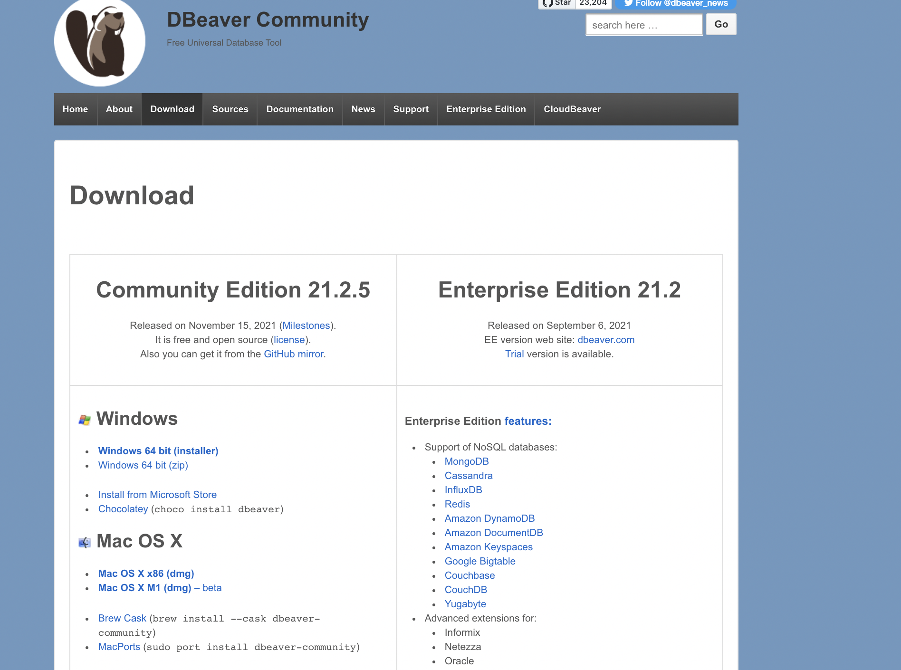
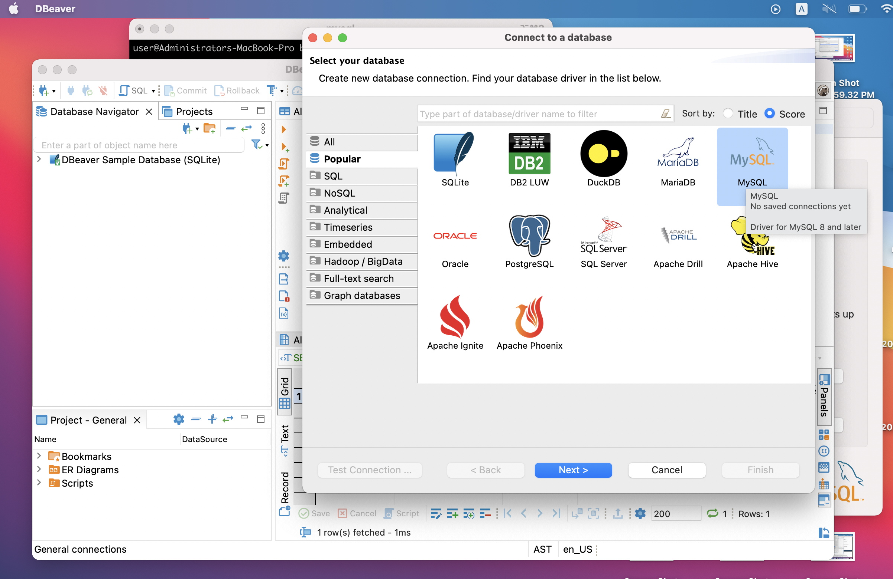
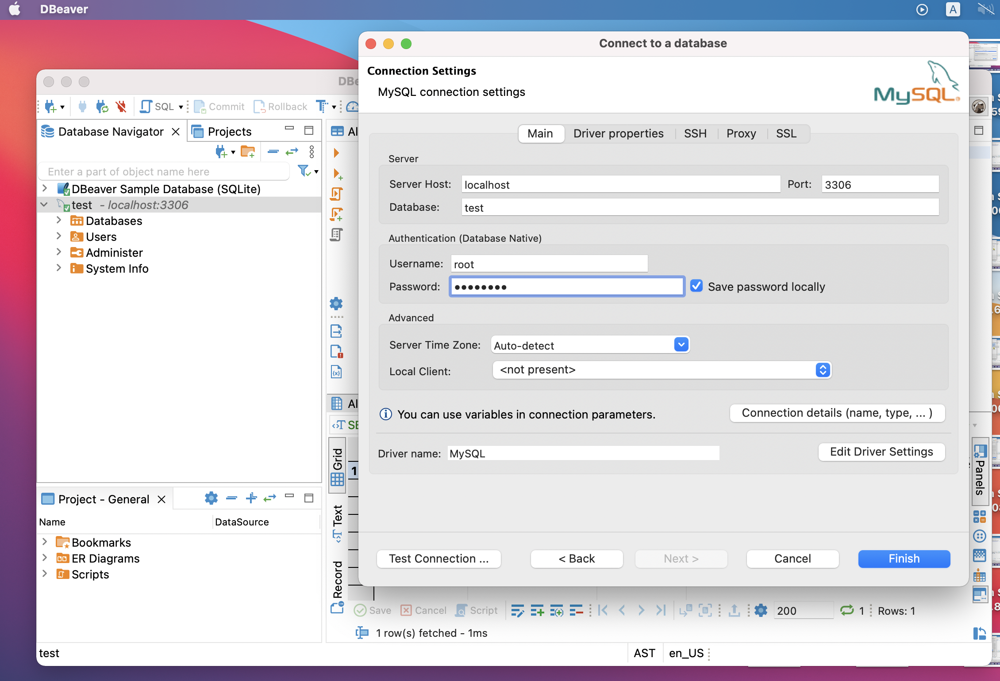

# Installation Guide 

## For Mac

1. Download MySQL Installer from https://dev.mysql.com/downloads/mysql/ and execute it.

2. Make sure you remember the password you enter here

3. Go to the terminal and to go to the path where your installer is in it should be `/usr/local/mysql/bin`

4. Enter `./mysql -u root -p` to go to the mysql  

5. it will ask for the password enter the password you entered earlier.  

6. Create database called test then exit mysql  

7. Install and setup dbeaver from https://dbeaver.io/download/

8. go to dbeaver and connect to MySQL 

9. Enter the name of the database you created and the password 

## For Windows 

1. Download MySQL Installer from https://dev.mysql.com/downloads/mysql/ and execute it.

2. Make sure you remember the password when executing the installer.

5. search for mysqlshell and open it 

6. Enter the following command to enter mysql 

- `\sql`
- `\connect root@localhost`

7. when you are in mysql create database by using this command 

- `create database test;`

8. Install and setup dbeaver from https://dbeaver.io/download/

9. go to dbeaver and connect to MySQL 

10. Enter the name of the database you created and the password 

